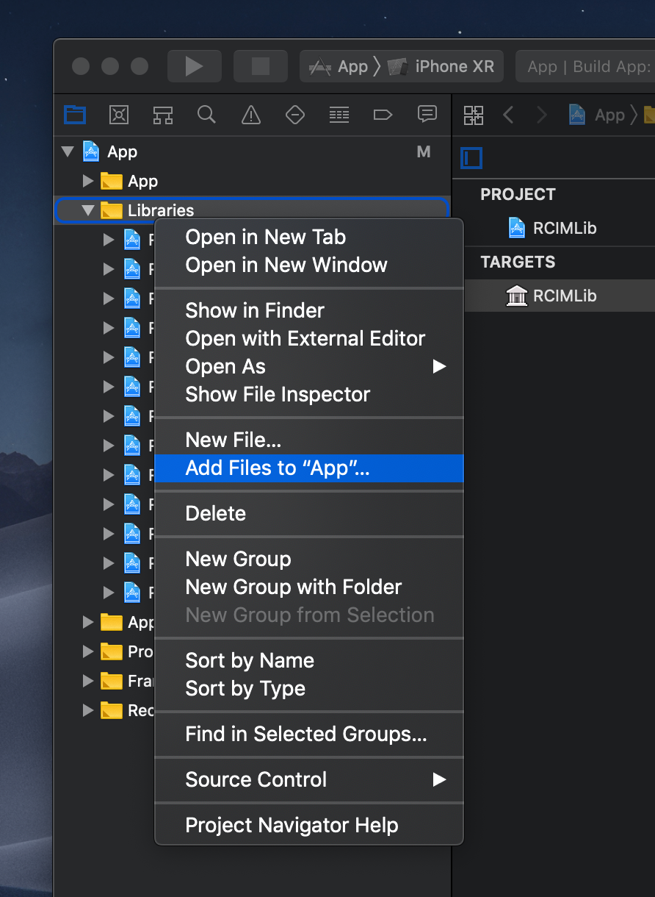
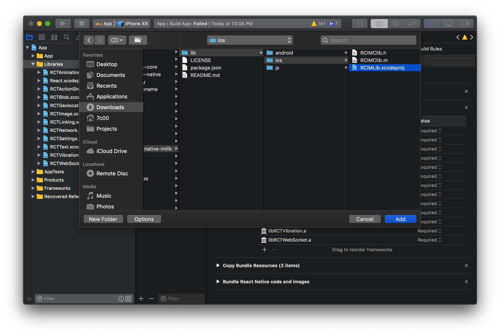
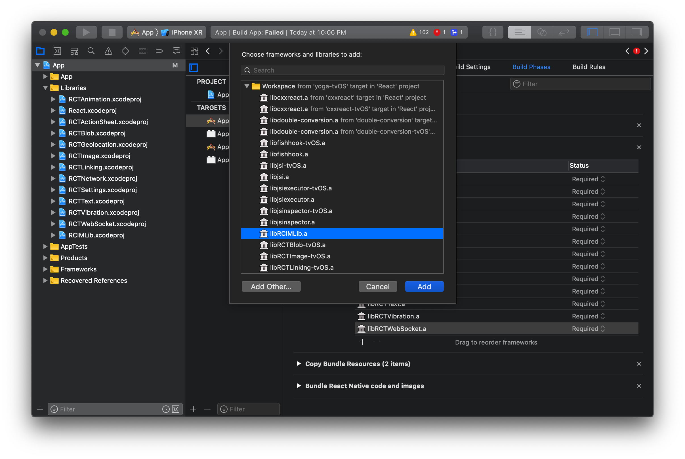
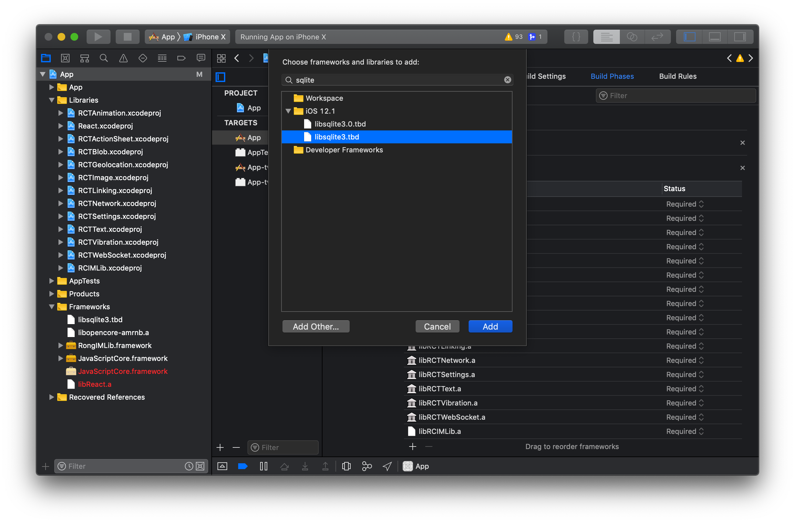

## SDK 配置

下载融云 [React Native IMLib](https://github.com/rongcloud/rongcloud-react-native-imlib?_blank) 开源项目。

```js
yarn add rongcloud-react-native-imlib
```

### Android

运行 `react-native link rongcloud-react-native-imlib` 进行自动配置（推荐），或按以下步骤进行手动配置：

1. 编辑 `android/settings.gradle` 新增：
  
  ```gradle
  include ':rongcloud-react-native-imlib'
  project(':rongcloud-react-native-imlib').projectDir = new File(rootProject.projectDir, '../node_modules/rongcloud-react-native-imlib/lib/android')
  ```

2. 编辑 `android/app/build.gradle`，新增依赖：
  
  ```js
  dependencies {
   ...
   compile project(':rongcloud-react-native-imlib')
  }
  ```

3. 编辑 `MainApplication.java`：
  
  导入 RCIMLibPackage
  
  ```java
  import cn.rongcloud.imlib.react.RCIMLibPackage;
  ```

  添加 RCIMLibPackage
  
  ```java
  @Override
  protected List<ReactPackage> getPackages() {
     return Arrays.asList(
             new MainReactPackage(),
             new RCIMLibPackage()
     );
  }
  ```

### iOS

运行 `react-native link rongcloud-react-native-imlib` 进行自动配置（推荐），或按以下步骤在 Xcode 进行手动配置：

1. Project navigator ➜ 右击 `Libraries` ➜ 选择 `Add Files to "XXXX"...`

   

2. 找到并选择添加 `node_modules/rongcloud-react-native-imlib/lib/ios/RCIMLib.xcodeproj`

  

3. `Build Phases` ➜ `Link Binary With Libraries` 中选择并添加 `libRNIMLib.a`

   

接下来，将 IMLib SDK 引入项目：

1. [从官网下载 IMLib SDK](https://www.rongcloud.cn/downloads)

2. 解压并把 `IMLib` 文件夹放到 `ios` 目录

3. 把 `IMLib` 里的 `libopencore-amrnb.a`、`libopencore-amrwb.a`、`libvo-amrwbenc.a`、`RongIMLib.framework`
   拖入 Project navigator `Frameworks`

4. `Build Phases` ➜ `Link Binary With Libraries` 里搜索并添加 `libsqlite3.tbd`

   

## SDK 集成

```javascript
// 按需导入方法
import { init, connect } from "rongcloud-react-native-imlib";

// 或导入所有方法到一个对象
import * as IMClient from "rongcloud-react-native-imlib";
```

### 初始化 SDK

您在使用融云 SDK 所有功能之前，您必须先调用此方法初始化 SDK。在 App 的整个生命周期中，您只需要将 SDK 初始化一次。

```javascript
import { init } from "rongcloud-react-native-imlib";

init("Your appKey");
```

### 连接服务器

在 App 整个生命周期，您只需要调用一次此方法与融云服务器建立连接。之后无论是网络出现异常或者 App 有前后台的切换等，SDK 都会负责自动重连。
SDK 针对 App 的前后台和各种网络状况，进行了连接和重连机制的优化，建议您调用一次 `connect` 即可，其余交给 SDK 处理。
除非您已经手动将连接断开，否则您不需要自己再手动重连。

```javascript
import { connect, ErrorCode } from "rongcloud-react-native-imlib";

function onSuccess(userId) {
  console.log("连接成功：" + userId);
}

function onError(errorCode) {
  console.log("连接失败：" + errorCode);
}

function onTokenIncorrect() {
  console.log("Token 不正确或已过期");
}

connect(
  token,
  onSuccess,
  onError,
  onTokenIncorrect
);
```

### 监听连接状态

```javascript
import { addConnectionStatusListener } from "rongcloud-react-native-imlib";

const listener = addConnectionStatusListener(status => console.log(status));

// 移除监听
listener.remove();
```

### 断开连接

```javascript
import { disconnect } from "rongcloud-react-native-imlib";

// 断开连接，但仍然可以接收推送消息
disconnect();

// 断开连接，不再接收推送消息
disconnect(false);
```
